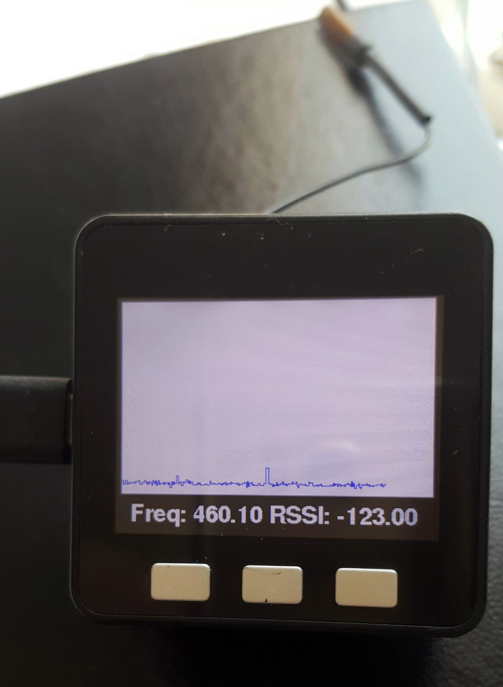

# M5 LoRa Frequency Hopping
Hops rapidly over the LoRa/sx1278 spectrum and displays RSSI.
Requires the M5LineGraph widget, part of https://github.com/Kongduino/M5Widgets (or remove the graphic code and watch the Serial monitor!)

